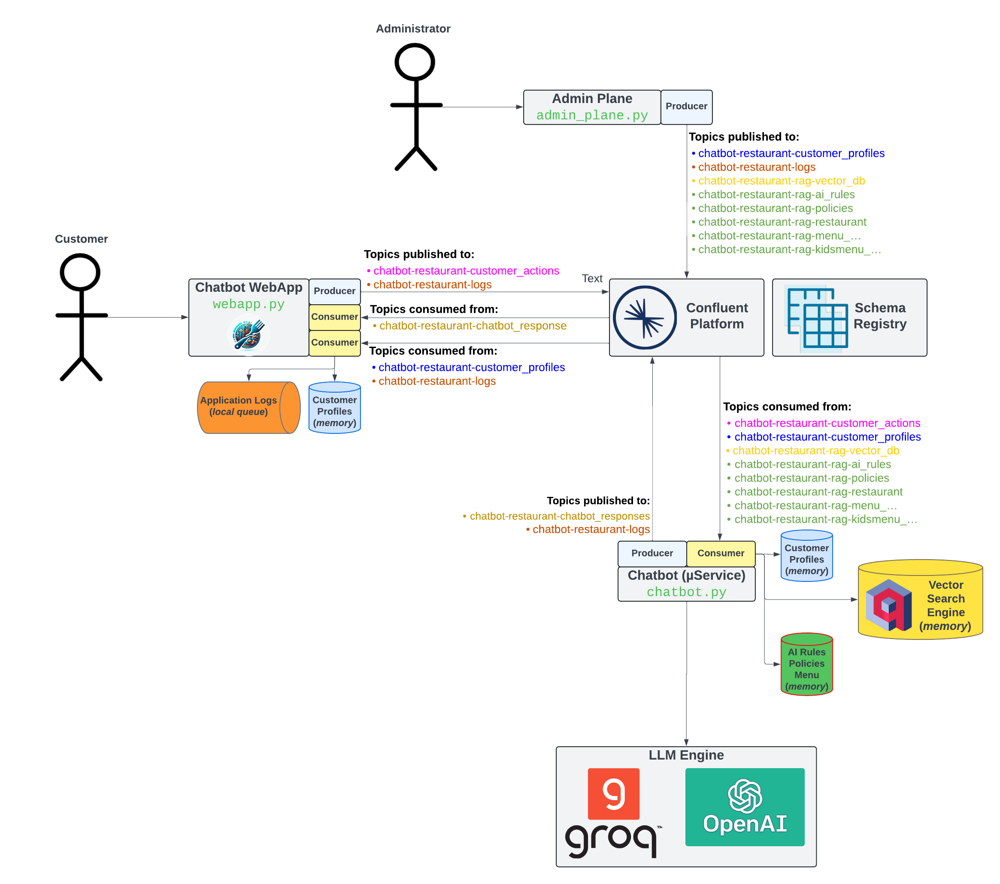
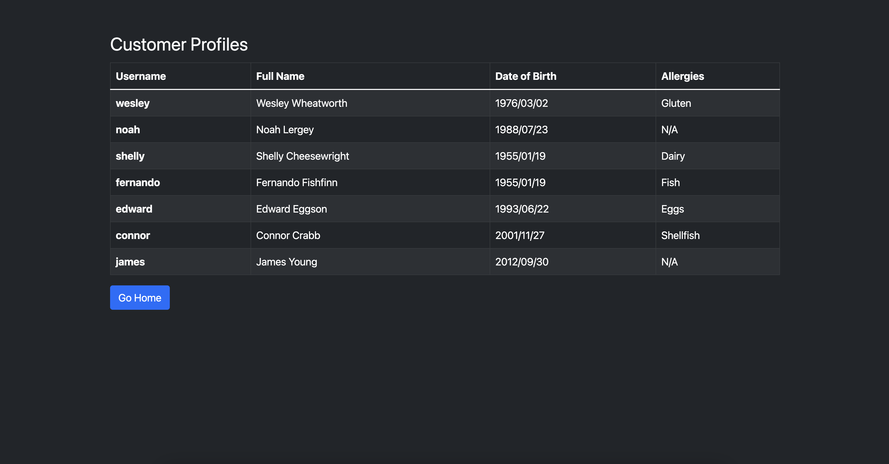
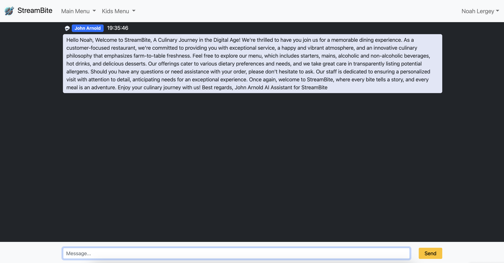
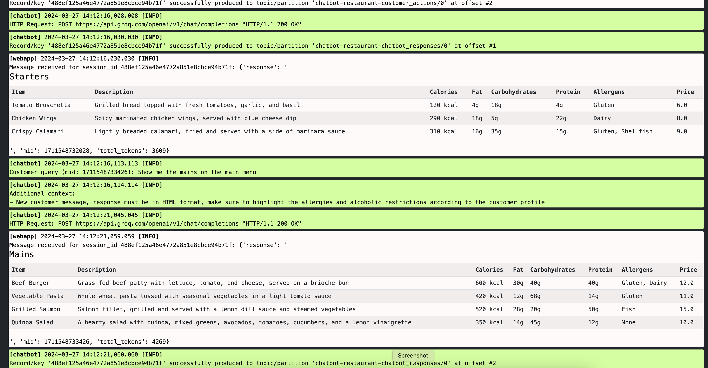

# chatbot-restaurant
Chatbot for a restaurant using [Confluent](https://www.confluent.io/lp/confluent-kafka), [OpenAI](https://openai.com/), [GroqCloud](https://console.groq.com) and [Qdrant](https://qdrant.tech/).

As GroqCloud is free to use the current LLM model used (`mixtral-8x7b-32768`) has the following limitations:
- Requests per minute: 30
- Requests per day: 14,400
- Tokens per minute: 18,000

If you prefer, you can opt to use OpenAI but it is a paid service.

Qdrant, although has the [SaaS Cloud](https://qdrant.tech/documentation/cloud/) option this demo uses the local [in memory version](https://github.com/qdrant/qdrant-client) of it.

## Demo Diagram
### Overview


### Detailed view


## Requirements
- [curl](https://curl.se/)
- [Docker Desktop](https://www.docker.com/products/docker-desktop/)
- [Python 3.8+](https://www.python.org/)

## The Demo
This demo runs all on Docker and it was only tested on a MAC M1. In case needed change the platform option to your needs (see variable `PLATFORM` on the file `.env`).

To be able to interact with OpenAI or Groq LLM model, you will need the following API key:
* [GroqCloud](https://console.groq.com) free LLM engine
* [OpenAI](https://platform.openai.com/docs/quickstart/account-setup) paid LLM engine

Having the API key at hand, create a file named `.env` file by executing the command:
```bash
cat > .env <<EOF
# Docker Compose
CONFLUENT_PLATFORM_VERSION="7.6.0"
PLATFORM="linux/arm64"
HOST="localhost"
# Configuration files
KAFKA_CONFIG="config/localhost.ini"
# Admin Plane
DATA_LOADER="config/default_loader.dat"
PASSWORD_SALT="<Any_string_here>"            # String to be used to salt hash passwords
CLIENT_ID_ADMIN_PLANE="chatbot-admin-plane-producer"
# Web App (Chatbot front-end)
WEBAPP_HOST="0.0.0.0"
WEBAPP_PORT=8888
CLIENT_ID_WEBAPP="chatbot-webapp"
TIMEOUT_SECONDS=120
# Chatbot back-end
CLIENT_ID_CHATBOT="chatbot-app"
LLM_ENGINE="openai"                          # Options: openai (paid), groq (free)
OPENAI_API_KEY="<Your_OpenAI_API_Key_Here>"  # Required if LLM_ENGINE=openai (Get the API Key here: https://platform.openai.com/docs/quickstart/account-setup)
GROQ_API_KEY="<Your_GroqCloud_API_Key_Here>" # Required if LLM_ENGINE=groq (Get the API Key here: https://console.groq.com)
BASE_MODEL="gpt-3.5-turbo-0125"              # Options: gpt-3.5-turbo-0125 (if LLM_ENGINE=openai), mixtral-8x7b-32768 (if LLM_ENGINE=groq)
MODEL_TEMPERATURE=0.3
VECTOR_DB_MIN_SCORE=0.3
VECTOR_DB_SEARCH_LIMIT=2
EOF
```

You are now ready to start the demo!

### Running the demo
You can make use of the shell script `./demo.sh` to have the demo started, stopped and restarted:
```
usage: ./demo.sh [-h, --help] [-x, --start] [-p, --stop] [-r, --restart]

Demo: Chatbot for a Restaurant (Confluent - All rights reserved)

Options:
 -h, --help     Show this help message and exit
 -x, --start    Start demo
 -p, --stop     Stop demo
 -r, --restart  Restart microservices
```

To automatically start the demo, run `./demo.sh -x`, once the docker images are downloaded, it should take less than 2 minutes to have everything up and running.
```
2024-03-22 17:17:02.000 [INFO]: Setting environment variables
2024-03-22 17:17:02.000 [INFO]: Starting docker compose
[+] Building 1.1s (12/12) FINISHEDdocker:desktop-linux
 => [chatbot internal] load build definition from Dockerfile
 => => transferring dockerfile: 282B
 => [chatbot internal] load metadata for docker.io/library/python:3.8-slim-buster
 => [chatbot internal] load .dockerignore
 => => transferring context: 2B
 => [chatbot 1/7] FROM docker.io/library/python:3.8-slim-buster@sha256:8799b0564103a9f36cfb8a8e1c562e11a9a6f2e3bb214e2adc23982b36a04511
 => [chatbot internal] load build context
 => => transferring context: 1.94kB
 => CACHED [chatbot 2/7] RUN apt-get update -y && apt-get install curl -y
 => CACHED [chatbot 3/7] WORKDIR /src
 => CACHED [chatbot 4/7] COPY src/requirements.txt requirements.txt
 => CACHED [chatbot 5/7] RUN pip install --no-cache-dir -r requirements.txt
 => CACHED [chatbot 6/7] COPY .env .
 => CACHED [chatbot 7/7] COPY src/ .
 => [chatbot] exporting to image
 => => exporting layers
 => => writing image sha256:ad1b103d2f2eea3d21774c13794b2b76ae4de431f1c8e03b65c61677d8f83d6b
 => => naming to docker.io/library/chatbot-restaurant-chatbot
[+] Running 5/6
 ⠧ Network chatbot-restaurant_default  Created
 ✔ Container zookeeper                 Started
 ✔ Container broker                    Started
 ✔ Container schema-registry           Started
 ✔ Container control-center            Started
 ✔ Container chatbot                   Started

2024-03-22 17:17:04.000 [INFO]: Waiting Schema Registry to be ready.........
2024-03-22 17:17:14.000 [INFO]: Waiting Confluent Control Center to be ready.......
2024-03-22 17:17:21.000 [INFO]: Waiting HTTP Server to be ready.
2024-03-22 17:17:22.000 [INFO]: Demo environment is ready!
```

At the end of the start up script, it should open the following web pages:
 - Confluent Control Center: http://localhost:9021
 - Chatbot Web application: http://localhost:8888

### Demo in details
As soon as the demo starts, the admin plane python script (`admin_plane.py`) will publishes the information below to the corresponding topics. That is done according to the data loader configuration file set on the environment variable `DATA_LOADER`, byt default it is `config/default_loader.dat`:
 - Customer Profiles:
   - Data file: `rag/customer_profiles.json`
   - Schema: `schemas/customer_profile.avro`
   - Topic: `chatbot-restaurant-customer_profiles`
 - AI Rules:
   - Data file = `rag/ai_rules.json`
   - Schema = `schemas/ai_rules.avro`
   - Topic = `chatbot-restaurant-rag-ai_rules`
 - Restaurant Policies
   - Data file = `rag/policies.json`
   - Schema = `schemas/policies.avro`
   - Topic = `chatbot-restaurant-rag-policies`
 - Restaurant Information
   - Data file = `rag/restaurant.json`
   - Schema = `schemas/restaurant.avro`
   - Topic = `chatbot-restaurant-rag-restaurant`
 - Vector DB
   - Data file = `rag/vector_db.json`
   - Schema = `schemas/vector_db.avro`
   - Topic = `chatbot-restaurant-rag-vector_db`
 - Main Menu
   - Data file = `rag/main_menu.json`
   - Schema = `schemas/menu_item.avro`
   - Topic prefix = `chatbot-restaurant-rag-menu_`
 - Kids Menu
   - Data file = `rag/kids_menu.json`
   - Schema = `schemas/menu_item.avro`
   - Topic prefix = `chatbot-restaurant-rag-kidsmenu_`

In parallel to that the back-end chatbot microservices (python script `chatbot.py`) will start and perform the following tasks:
 - Thread #1:
   - Load in memory the Customer Profiles, AI Rules, Restaurant Policies, Restaurant Information, Main Menu and Kids Menu (as consumed from the corresponding topics)
   - Run a Qdrant vector search engine in memory, create a local collection (`chatbot_restaurant`), generate the embeddings (using sentence transformer `all-MiniLM-L6-v2`) and load add Vector DB data (as consumed from the corresponding topic) into it
 - Thread #2:
   - Consume the customer messages from topic `chatbot-restaurant-customer_actions` and post it to the LLM engine (as set on the environment variable `LLM_ENGINE`). It uses LangChain to be able to seemlesly interact with OpenAI and GroqCloud. All messages are buffered in memory per user session and cleared after logout. This can be optmised in order to reduce the number of tokens passed everything to the LLM engine
   - Once it receives the response from the LLM engine it will have it published into the topic `chatbot-restaurant-chatbot_responses`

The last python script is the web application (`webapp.py`):
 - It communicates with the back-end chatbot microservices using the [CQRS pattern](https://www.confluent.io/resources/ebook/designing-event-driven-systems)
 - After successfuly login, the customer messages will be published to the topic `chatbot-restaurant-customer_actions` so it can be processed by the back-end microservices
 - It will also consume the messages from the topic `chatbot-restaurant-chatbot_responses` matching the sessionID with the messageID (mid), then presenting it to the corresponding customer

All three python scripts have two logging handles, one to the console and another one to the Kafka topic `chatbot-restaurant-logs`. The Web Application will consume all messages in that topic so it can be rendered when accessing http://localhost:8888/logs.

### Stopping the demo
To stop the demo, please run `./demo.sh -p`.

```
2024-03-22 17:29:07.000 [INFO]: Stopping docker compose

[+] Running 6/5
 ✔ Container chatbot                   Removed
 ✔ Container control-center            Removed
 ✔ Container schema-registry           Removed
 ✔ Container broker                    Removed
 ✔ Container zookeeper                 Removed
 ✔ Network chatbot-restaurant_default  Removed

2024-03-22 17:29:30.000 [INFO]: Demo successfully stopped
```

## Runtime Demo and Screenshots
### Demo


### Login screen


### Customer Profiles
To access that page go to http://localhost:8888/profiles (password is the same as the username)


### Initial message after login


### Asking for the main menu


### Going through some of the restaurant policies


### System logs
They can be accessed through http://localhost:8888/logs. All applications are producing logs to Confluent Platform and the web application is consuming them, adding to a local queue and off-loading the queue once the logs page is opened (logs are refreshed at every 500ms)


## External References
Check out [Confluent's Developer portal](https://developer.confluent.io), it has free courses, documents, articles, blogs, podcasts and so many more content to get you up and running with a fully managed Apache Kafka service.

Disclaimer: I work for Confluent :wink: